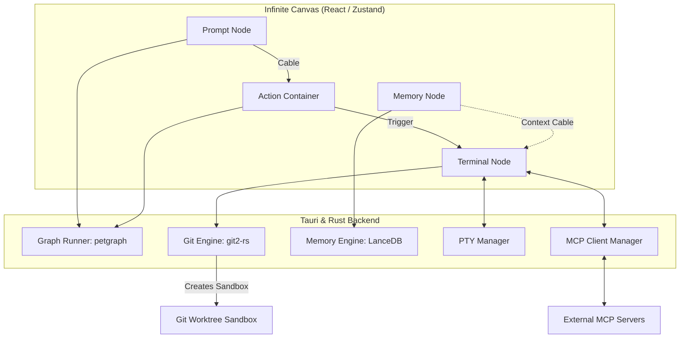

# Central ⚡

[](https://tauri.app/)
[](https://react.dev/)
[](https://www.rust-lang.org/)
[](https://www.typescriptlang.org/)
[](https://tailwindcss.com/)
[](https://lancedb.com/)

Central is a state-of-the-art **Visual Multi-Agent Orchestrator** and **Infinite Canvas IDE** designed to build, execute, and monitor complex agent pipelines in isolated, zero-risk environments. 

By combining a Figma-like design canvas, a robust Rust-powered Directed Acyclic Graph (DAG) executor, automated Git worktree sandboxing, local vector database memory, and Model Context Protocol (MCP) tool integration, Central turns agent workflows into clean, interactive, and robust visual pipelines.

---

## 🎨 Visual Preview & Architecture

Central allows you to visually connect different types of nodes (Prompts, Actions, Memory, and Terminals) using cables. Behind the scenes, the runner schedules execution, injects memories, invokes MCP tools, and spawns isolated Git worktrees.



---

## 🚀 Key Features

### 1. Infinite Canvas & Gesture Viewport
* **Figma-Style Navigation**: Smooth pan, zoom, and selection tools with offscreen node culling optimized for large graphs.
* **Snap-to-Alignment Guides**: Drag and align nodes with dynamic green layout guides.
* **Interactive Cables**: Create, drag, and connect input/output/trigger/context sockets to define operational flow.

### 2. Git Worktree Sandboxing
* **Isolated Executions**: Every terminal run spawns an ephemeral Git worktree sandbox under the hood. Agents cannot pollute or corrupt your main branch.
* **Handoff Tracking**: Visualizes git diffs (insertions, deletions, files changed) directly on the cables connecting nodes.
* **Rollback Capabilities**: Restore any node state or rollback worktree branch modifications in a single click.

### 3. Petgraph-Powered DAG Scheduler
* **Topology Sorting**: Runs workflows in topological order, detecting cycles automatically.
* **Retry Loop**: Retries failing nodes automatically up to `maxRetries` if compilation or test execution fails.
* **Real-time Event Streaming**: Frontend listens to event streams for `node-started`, `node-finished`, and `cable-handoff`.

### 4. Interactive Terminals (PTY + xterm.js)
* **Real Shell Sessions**: Embedded terminals stream live terminal output using Tauri PTY streams.
* **Terminal Toolbelt**: Clean UI hud to trigger facts, adjust context, or restart processes.

### 5. LanceDB Local Vector Memory
* **Semantic Vector Search**: Vectorize, search, and recall memories and facts (`.aimem`) using an embedded LanceDB database.
* **Knowledge Vault**: Link memory nodes directly to terminal nodes for memory-aware agent executions.
* **Obsidian Integration**: Export your memory graph directly to Obsidian markdown vaults.

### 6. Model Context Protocol (MCP) Integration
* **Dynamic Tool Registry**: Connect to local or remote MCP servers to list, examine, and invoke custom agent tools.
* **Active Status Monitors**: Monitor connected server states live from the Sidebar panel.

---

## 📂 Repository Structure

The project is structured as a Tauri v2 desktop application workspace:

```text
├── src/                      # Frontend Application (React, TypeScript, Tailwind)
│   ├── components/
│   │   ├── canvas/           # Canvas engine, SVG edge layer, zoom toolbar, and guides
│   │   │   └── nodes/        # Terminal, Prompt, Memory, Action, and Container nodes
│   │   ├── sidebar/          # Mcp Servers, Deployments, and Ephemeral runs list
│   │   └── ui/               # Reusable primitive design system components
│   ├── store/                # Zustand client state (canvasState, mcpState, providerState)
│   ├── lib/                  # Canvas geometry, drag controllers, and viewport calculations
│   └── App.tsx               # Primary layout composition
│
├── src-tauri/                # Rust Backend (Tauri v2)
│   ├── src/
│   │   ├── mcp/              # MCP client implementation and Tauri commands
│   │   ├── memory/           # LanceDB-backed Vector Memory Engine
│   │   ├── git_engine.rs     # Git worktree sandbox manager using git2-rs
│   │   ├── graph_runner.rs   # Toposort DAG executor using petgraph
│   │   ├── pty_manager.rs    # Cross-platform PTY stream management
│   │   └── lib.rs            # Tauri setup and handler registration
│   └── Cargo.toml            # Rust dependencies
```

---

## 🛠️ Getting Started

### Prerequisites

Ensure you have the following installed on your machine:
* **Node.js** (v18+)
* **pnpm** (preferred package manager)
* **Rust & Cargo** (for building the Tauri backend)
* System dependencies for Tauri (visit the [Tauri v2 Setup Guide](https://tauri.app/v2/start/prerequisites/) for your OS).

### Setup and Installation

1. Clone the repository:
   ```bash
   git clone https://github.com/tigokraft/central.git
   cd central
   ```

2. Install frontend dependencies:
   ```bash
   pnpm install
   ```

3. Run the development server:
   ```bash
   pnpm tauri dev
   ```
   This will boot the Vite dev server and compile the Rust backend, opening the desktop client.

---

## ⚡ Built-In Presets

Central ships with two preset templates to get started quickly, accessible via the **Sidebar Presets Panel**:

### 🔁 Code Loop
Connects a prompt node generating code to an action container checking formatting and running tests, hooked to a compilation target node. Excellent for automated continuous-integration loops.

### 🔍 Review Pipeline
Applies static analysis rules and clean architecture constraints to verify changes before allowing a git merge, feeding findings directly back to memory.

---

## 📄 License

This project is private and licensed under standard repository terms. Created by [tigokraft](https://github.com/tigokraft).
